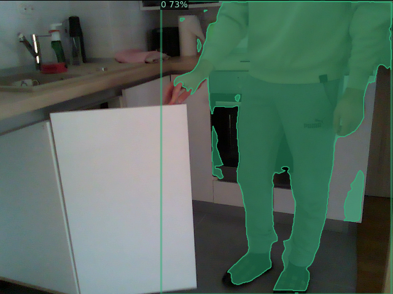
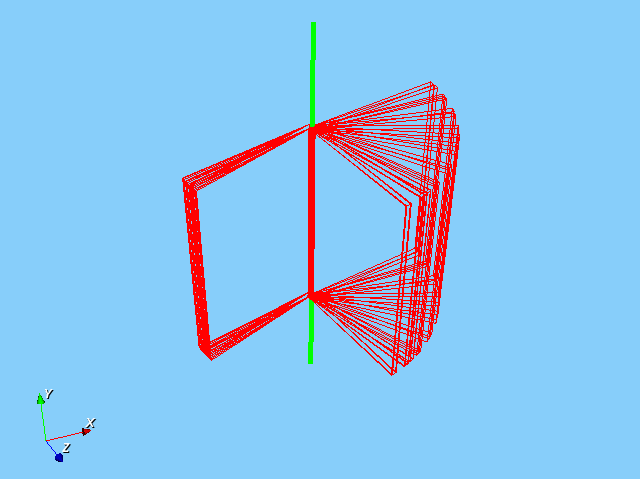

# Robot Door Opening Pipeline From Human Demonstration

This repository contains a Docker setup which involves:
- Robotic Vision Library (RVL)
- ROS with packages for controlling the UR5 robot
- TensorMask from detectron2

## Installation

### Docker Installation

You will need a PC that supports **Nvidia drivers and CUDA** in order to launch TensorMask.

**Ubuntu:**
Install Docker from the [official page](https://docs.docker.com/engine/install/ubuntu/). Do not forget to do the [postinstall steps](https://docs.docker.com/engine/install/linux-postinstall/).

**Windows:**
Install Docker from the [official page](https://docs.docker.com/desktop/install/windows-install/). To run the necessary shell scripts, you can use [WSL](https://learn.microsoft.com/en-us/windows/wsl/install).

Additionally, install the NVIDIA Container Toolkit.

### Container Setup (Linux)

1. Clone and enter the repository:
   ```bash
   git clone --recurse-submodules https://github.com/vsimundic/ur5-door-interaction.git
   cd ur5-door-interaction/docker
   ```

2. Run the shell script to build the Docker image:
   ```bash
   ./build_docker.sh
   ```

3. Enable X11 forwarding (required for GUI):
   ```bash
   xhost +local:root
   ```

4. Run the Docker container:
   ```bash
   ./run_docker.sh
   ```
   *The script will attempt to stop and remove any existing container instance first. You can ignore errors if no container was running.*

5. Open additional terminals inside the container:
   ```bash
   docker exec -it ur5_door_interaction bash
   ```

# Door and Drawer Detection

## Data Setup

Before running the project, download and place the required data files in the correct directories.

1. **Project Root Data**
   - Download **[kitchen_data.zip](https://puh.srce.hr/s/XLZYmHE58zi9NzA)**.
   - Unzip into `data/` at the repository root.
   - *Example Path:* `ur5-door-interaction/data/kitchen_data/...`

2. **TensorMask Weights**
   - Store the pre-trained weights in `data/weights/`:
     ```bash
     mkdir -p data/weights/TensorMask
     wget https://dl.fbaipublicfiles.com/detectron2/TensorMask/tensormask_R_50_FPN_1x/152549419/model_final_8f325c.pkl -O data/weights/TensorMask/tensormask_R_50_FPN_1x.pkl
     ```

## Demo Usage

### 1. Detectron2 Rosbag Segmentation

Build the segmentation workspace:
```bash
cd human_segmentation_ws
catkin_make
source devel/setup.bash
``` 

**Configuration:**
Adjust `config.yaml` inside the `human_seg` package if necessary. Ensure paths exist (examples below):
```yaml
load_path_root: "/home/RVLuser/data/kitchen_data/bags"
save_path_root: "/home/RVLuser/data/kitchen_data/segmented_data"
config_path: "/opt/detectron2/projects/TensorMask/configs/tensormask_R_50_FPN_1x.yaml"
```

Inside the bags folder, create `bags_sequences.txt` listing your bags:
```txt
bag1.bag
bag2.bag
...
```

Run the segmentation:
```bash
rosrun human_seg segment_videos.py
```

**Segmentation Result:**
The output directory structure will look like this:
```
kitchen0001/
├── camera_info.yaml
├── depth_seg/
├── hyps.txt/
├── PLY_seg/       # (Empty initially, populated in next step)
├── rgb/
├── rgb_seg/
└── SceneSequence.txt
```



### 2. Running Detection (RVL)

The main configuration file is `rvl-linux/RVLRecognitionDemo.cfg`. It loads specific sub-configs.
For this demo, ensure `RVLRecognitionDemo_Cupec_DDD2_Detection.cfg` is **uncommented** in `RVLRecognitionDemo.cfg`.

*Note: If you changed the `kitchen_data` path, update `RVLRecognitionDemo_Cupec_DDD2_Detection.cfg` accordingly.*

**Step A: Creating PLY files**

1. In `RVLRecognitionDemo_Cupec_DDD2_Detection.cfg`, set `Save PLY` to `yes`.
2. Build and run RVL:
   ```bash
   cd rvl-linux
   make
   ./build/bin/RVLRecognitionDemo
   ```
   This populates the `PLY_seg` directory.

**Step B: Running Detection**

1. Change `Save PLY` to `no` in the config file.
2. Run the demo again:
   ```bash
   ./build/bin/RVLRecognitionDemo
   ```

*If the program crashes, verify all paths in the config files.*

## Results

A window displaying hypotheses will appear. Press `q` to cycle through them until the window closes.



**Final Detection:**


Results are saved to `DDT.txt`. Each line represents a detected moving part (Door/Drawer) with 19 tab-separated values:

| Column | Name | Type | Description |
|--------|------|------|-------------|
| 1 | Object Class | Integer | Class ID of the object |
| 2-4 | R00-R02 | Float | Rotation matrix row 0 |
| 5-7 | R10-R12 | Float | Rotation matrix row 1 |
| 8-10 | R20-R22 | Float | Rotation matrix row 2 |
| 11 | tx | Float | Position X |
| 12 | ty | Float | Position Y |
| 13 | tz | Float | Position Z |
| 14 | Reserved | Float | Always 0.0 |
| 15 | Width | Float | Dimension 0 (s[0]) |
| 16 | Height | Float | Dimension 1 (s[1]) |
| 17 | Radius/Param 0 | Float | Additional parameter 0 (r[0]) |
| 18 | Radius/Param 1 | Float | Additional parameter 1 (r[1]) |
| 19 | Opening Direction | Float | Direction of opening |

# Multicontact Path Planning for Door Opening

## Data Setup

1. **Workspace Data**
   - Download **[ur5_ws_data.zip](https://puh.srce.hr/s/TtGAjke5JrFkHcD)**.
   - Unzip into `ferit_ur5_ws/data/`.
   - *Example Path:* `ur5-door-interaction/ferit_ur5_ws/data/...`

## Demo Usage

### 1. RVL Multicontact Planning
The main configuration file is `rvl-linux/RVLMotionDemo.cfg`. It loads specific sub-configs.
For this demo, ensure `RVLMotionDemo_Cupec.cfg` is **uncommented** in `RVLMotionDemo.cfg`.

*Note: If you changed the `kitchen_data` path, update `RVLRecognitionDemo_Cupec_DDD2_Detection.cfg` accordingly.*

**Step A: Creating PLY files**

1. In `RVLRecognitionDemo_Cupec_DDD2_Detection.cfg`, set `Save PLY` to `yes`.
2. Build and run RVL:
   ```bash
   cd rvl-linux
   make
   ./build/bin/RVLRecognitionDemo
   ```
   This populates the `PLY_seg` directory.


# Failure Recovery in Door Opening
*TBD*

## License

[MIT](https://choosealicense.com/licenses/mit/)
