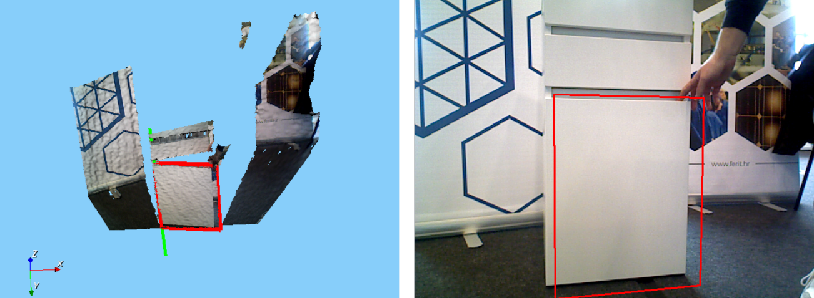

# Robot Door Opening Pipeline From Human Demonstration

This repository contains a Docker setup which involves:
- Robotic Vision Library (RVL),
- ROS with packages for controlling the UR5 robot and
- TensorMask from detectron2.

# Installation

### Docker installation

You will need a PC that supports **Nvidia drivers and CUDA** in order to launch TensorMask.

Ubuntu: 
Install Docker from the [official page](https://docs.docker.com/engine/install/ubuntu/). Don't forget to do the [postinstall steps](https://docs.docker.com/engine/install/linux-postinstall/).

Windows:
Install Docker from the [official page](https://docs.docker.com/desktop/install/windows-install/). To run the necessary shell scripts, you can use [WSL](https://learn.microsoft.com/en-us/windows/wsl/install).

Additionally, install the NVIDIA Container Toolkit.

### Container setup (Linux)

Clone and enter the repository:
```bash
git clone --recurse-submodules https://github.com/vsimundic/ur5-door-interaction.git

cd ur5-door-interaction
```

Run the shell script to build the Docker image:
```bash
./build_docker.sh
```

To be able to show any windows from the container, run:
```bash
xhost +
```
This command should be ran on every login. To avoid it, you can add it to .bashrc:
```bash
echo 'xhost +' >> ~/.bashrc 
```

After installation, run the Docker container:
```bash
./run_docker.sh
```
The scripts will first stop and remove the current container if it exists. If it doesn't it will output an error that it can't stop or remove the container, but they can be ignored.

The container is now initialized and running. You can run `ls` command to check if the rvl-linux and ferit_ur5_ws directories are listed. If not, exit the current instance of the container and change the first part of the first --volume argument to look like this:
```bash
--volume="/path/to/your/project/dir:/home/RVLuser" \
```
Rerun the container with:
```bash
./run_docker.sh
```

If you need more terminals inside the container, you can create a new one with:
```bash
docker exec -it ur5_door_interaction bash
```


### VSCode setup

While the container is running, you can setup the VSCode to work inside the container.
A tutorial on the developing inside a container can be found [here](https://code.visualstudio.com/docs/devcontainers/containers).

Inside the container, you may consider installing some extensions: Python, C/C++, ROS, CMake, Makefile Tools. These aren't necessary, but are helpful. 

You don't need to setup any VSCode environments as they are already set to work with the container's paths (for RVL, ur5_ws and detectron2). 


# Door and Drawer Detection

## Data Setup

Before running the project, you must download and place the required data files in the correct directories.

1. **Project Root Data**
   - Download **[summit_LOAD.zip](https://puh.srce.hr/s/mfYM3TjfLNXWBwp)**.
   - Unzip the contents into the `data/` directory located at the root of this repository.
   - *Final path example:* `ur5-door-interaction/data/summit_LOAD/...`

2. **Workspace Data**
   - Download **[ur5_ws_data.zip](https://puh.srce.hr/s/TtGAjke5JrFkHcD)**.
   - Unzip the contents into the `data/` directory inside `ferit_ur5_ws`.
   - *Final path example:* `ur5-door-interaction/ferit_ur5_ws/data/...`

3. **TensorMask weights**
   - Store the following pre-trained weights in `data/weights/` directory:
   ```bash
   mkdir -p data/weights/TensorMask
   wget https://dl.fbaipublicfiles.com/detectron2/TensorMask/tensormask_R_50_FPN_1x/152549419/model_final_8f325c.pkl -O data/weights/TensorMask/tensormask_R_50_FPN_1x.pkl
   ```

## Build
Build RVL:
```bash
cd rvl-linux
make
``` 

## Demo Usage

### Detectron2 Rosbag Segmentation

TODO: find a bagfile.

### Door and Drawer Detection
In `rvl-linux` directory, there is a file called `RVLRecognitionDemo.cfg`, which represents the main config file. This file is used to load specific config files which use different parts of code. For this demo, we use `RVLRecognitionDemo_Cupec_DDD2_Detection_LOAD.cfg`. Please make sure that this specific config file is NOT commented in `RVLRecognitionDemo.cfg`.

Also, please make sure that you download the `summit_LOAD.zip` and unpack it in the right directory. You can change the path of the directory, but then adjust the paths in `RVLRecognitionDemo_Cupec_DDD2_Detection_LOAD.cfg`.

While inside `rvl-linux`, run:
```bash
./build/bin/RVLRecognitionDemo
```



# Multicontact Path Planning for Door Opening
TBD

# Failure Recovery in Door Opening
TBD

# License

[MIT](https://choosealicense.com/licenses/mit/)
