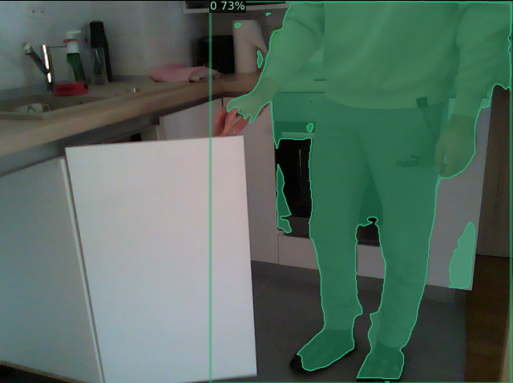
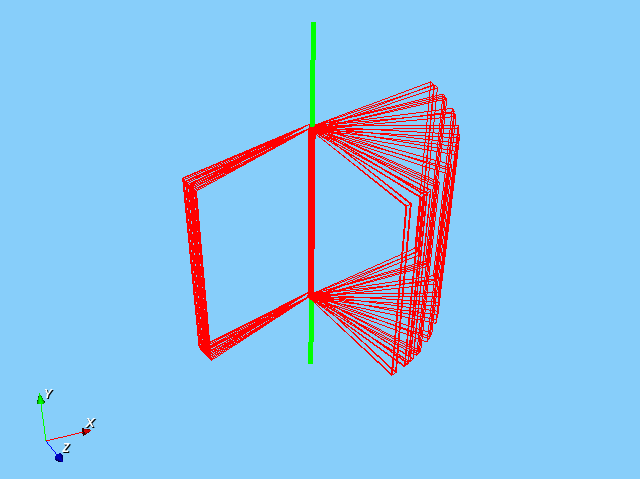
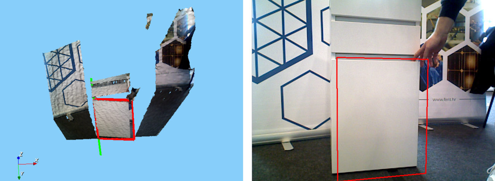
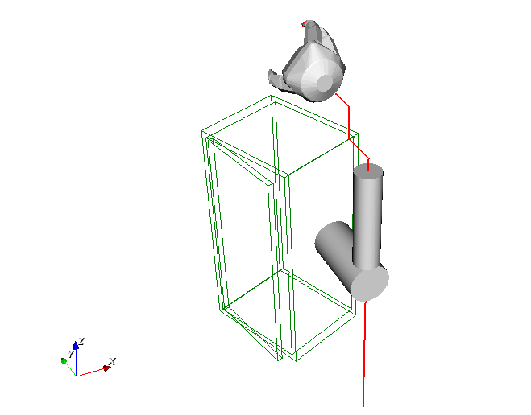
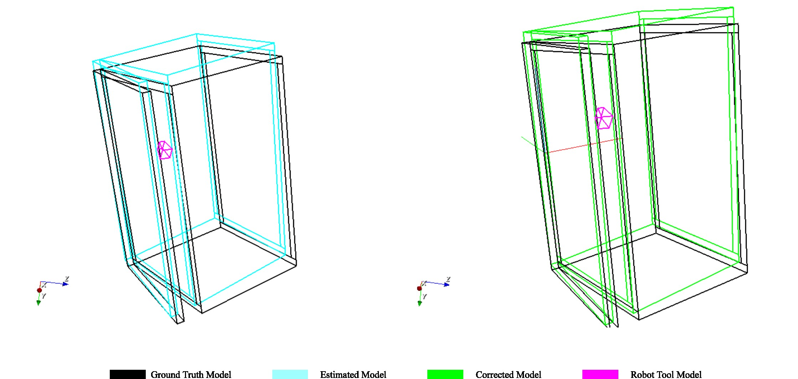

# Robot Door Opening Pipeline From Human Demonstration

> **For more information, please visit our [site](https://multi-contact-door.github.io/).**

This repository contains a Docker setup which involves:
- **[Robotic Vision Library (RVL)](https://github.com/vsimundic/rvl-linux)**
- **ROS** with packages for controlling the UR5 robot
- **TensorMask** from detectron2

---

## Table of Contents
1. [Installation](#installation)
2. [Door and Drawer Detection](#door-and-drawer-detection)
3. [Multi-Contact Path Planning for Door Opening](#multi-contact-path-planning-for-door-opening)
4. [Failure Recovery in Door Opening](#failure-recovery-in-door-opening)
5. [License](#license)

---

## Installation

### Docker Installation

You will need a PC that supports **Nvidia drivers and CUDA** in order to launch TensorMask.

- **Ubuntu:** Install Docker from the [official page](https://docs.docker.com/engine/install/ubuntu/). Do not forget to do the [post-installation steps](https://docs.docker.com/engine/install/linux-postinstall/).
- **Windows:** Install Docker from the [official page](https://docs.docker.com/desktop/install/windows-install/). To run the necessary shell scripts, you can use [WSL](https://learn.microsoft.com/en-us/windows/wsl/install).

Additionally, install the **NVIDIA Container Toolkit**.

### Container Setup (Linux)

1. **Clone and enter the repository:**
   ```bash
   git clone --recurse-submodules https://github.com/vsimundic/ur5-door-interaction.git
   cd ur5-door-interaction/docker
   ```

2. **Run the shell script to build the Docker image:**
   ```bash
   ./build_docker.sh
   ```

3. **Enable X11 forwarding** (required for GUI):
   ```bash
   xhost +local:root
   ```

4. **Run the Docker container:**
   ```bash
   ./run_docker.sh
   ```
   > *Note: The script will attempt to stop and remove any existing container instance first. You can ignore errors if no container was running.*

5. **Open additional terminals inside the container:**
   ```bash
   docker exec -it ur5_door_interaction bash
   ```

---

## Door and Drawer Detection

### Data Setup

Before running the project, download and place the required data files in the correct directories.

1. **Project Root Data**
   - Download **[kitchen_data.zip](https://puh.srce.hr/s/XLZYmHE58zi9NzA)**.
   - Unzip into `data/` at the repository root.
   - *Example Path (host):* `ur5-door-interaction/data/kitchen_data/...`

2. **TensorMask Weights**
   - Store the pre-trained weights in `data/weights/`:
     ```bash
     mkdir -p data/weights/TensorMask
     wget https://dl.fbaipublicfiles.com/detectron2/TensorMask/tensormask_R_50_FPN_1x/152549419/model_final_8f325c.pkl -O data/weights/TensorMask/tensormask_R_50_FPN_1x.pkl
     ```

### Demo Usage

#### 1. Detectron2 Rosbag Segmentation

Build the segmentation workspace:
```bash
cd human_segmentation_ws
catkin_make
source devel/setup.bash
``` 

**Configuration:**
Adjust `config.yaml` inside the `human_seg` package if necessary. Ensure paths exist (examples below):
```yaml
load_path_root: "/home/RVLuser/data/kitchen_data/bags"
save_path_root: "/home/RVLuser/data/kitchen_data/segmented_data"
config_path: "/opt/detectron2/projects/TensorMask/configs/tensormask_R_50_FPN_1x.yaml"
```

Inside the bags folder, create `bags_sequences.txt` listing your bags:
```txt
bag1.bag
bag2.bag
...
```

Run the segmentation:
```bash
rosrun human_seg segment_videos.py
```

**Segmentation Result:**
The output directory structure will look like this:
```text
kitchen0001/
├── camera_info.yaml
├── depth_seg/
├── hyps.txt/
├── PLY_seg/       # (Empty initially, populated in next step)
├── rgb/
├── rgb_seg/
└── SceneSequence.txt
```



#### 2. Running Detection (RVL)

The main configuration file is `rvl-linux/RVLRecognitionDemo.cfg`. It loads specific sub-configs.
For this demo, ensure `RVLRecognitionDemo_Cupec_DDD2_Detection.cfg` is **uncommented** in `RVLRecognitionDemo.cfg`.

> *Note: If you changed the `kitchen_data` path, update `RVLRecognitionDemo_Cupec_DDD2_Detection.cfg` accordingly.*

**Step A: Creating PLY files**
1. In `RVLRecognitionDemo_Cupec_DDD2_Detection.cfg`, set `Save PLY` to `yes`.
2. Build and run RVL:
   ```bash
   cd rvl-linux
   make
   ./build/bin/RVLRecognitionDemo
   ```
   *This populates the `PLY_seg` directory.*

**Step B: Running Detection**
1. Change `Save PLY` to `no` in the config file.
2. Run the demo again:
   ```bash
   ./build/bin/RVLRecognitionDemo
   ```

> *If the program crashes, verify all paths in the config files.*

### Results

A window displaying hypotheses will appear. Press `q` to cycle through them until the window closes.



**Final Detection:**



Results are saved to `DDT.txt`. Each line represents a detected moving part (Door/Drawer) with 19 tab-separated values:

| Column | Name | Type | Description |
|:---:|:---|:---:|:---|
| 1 | Object Class | Integer | Class ID of the object |
| 2-4 | R00-R02 | Float | Rotation matrix row 0 |
| 5-7 | R10-R12 | Float | Rotation matrix row 1 |
| 8-10 | R20-R22 | Float | Rotation matrix row 2 |
| 11 | tx | Float | Position X |
| 12 | ty | Float | Position Y |
| 13 | tz | Float | Position Z |
| 14 | Reserved | Float | Always 0.0 |
| 15 | Width | Float | Dimension 0 (s[0]) |
| 16 | Height | Float | Dimension 1 (s[1]) |
| 17 | Radius/Param 0 | Float | Additional parameter 0 (r[0]) |
| 18 | Radius/Param 1 | Float | Additional parameter 1 (r[1]) |
| 19 | Opening Direction | Float | Direction of opening |

---

## Multi-Contact Path Planning for Door Opening

### Data Setup

1. **Robotiq 3F Data**
   - Download **[Robotiq3Finger.zip](https://puh.srce.hr/s/kNGCqm63mc24zw6)**
   - Unzip into `data/`.
   - *Example Path (host):* `ur5-door-interaction/data/Robotiq3Finger/...`

2. **Project Root Data**
   - Download **[ur5_ws_data.zip](https://puh.srce.hr/s/TtGAjke5JrFkHcD)**.
   - Unzip into `data/`.
   - *Example Path (host):* `ur5-door-interaction/data/multi-contact/...`

### Demo Usage

#### 0. RVL Generating Feasible Poses
Run the script for generating feasible poses:
```bash
cd rvl-linux/python/DDMan
python3 push_demo.py
```
> `valid_contact_poses.npy` and `feasible_poses_left_axis.npy` will be saved in `/home/RVLuser/data/Robotiq3Finger`.

#### 1. RVL Multi-Contact Path Planning
The main configuration file is `rvl-linux/RVLMotionDemo.cfg`. It loads specific sub-configs.
For this demo, ensure `RVLMotionDemo_Cupec.cfg` is **uncommented** in `RVLMotionDemo.cfg`.

> *Note: If you changed paths, update `RVLMotionDemo_Cupec.cfg` accordingly.*

Build and run RVL:
```bash
cd rvl-linux
make
./build/bin/RVLRecognitionDemo
```



#### 2. ROS Gazebo Multi-Contact Path Planning With UR5

Build the `ferit_ur5_ws` workspace:
```bash
cd ferit_ur5_ws
catkin build
source devel/setup.bash
```

> *Note: All config files used for this method are placed in `ferit_ur5_ws/src/cosper/path_planning/config`.*

**Generating Cabinet Configurations:**
```bash
rosrun path_planning generate_cabinet_configurations.py
```
> *Cabinet configurations are by default stored in `/home/RVLuser/data/multi-contact/cabinet_configurations_axis_left.npy`.*

**Run the Multi-Contact Simulations:**
```bash
rosrun path_planning multi-c_our_handleless.py
```
> *The script runs through all cabinets saving results by default in `/home/RVLuser/data/multi-contact/simulations/results_multi-c_our_handleless.csv`.*


---

## Failure Recovery in Door Opening

### Data Setup

1. **Experiments Data**
   - Download **[Exp-correct_calibration-20250616.zip](https://puh.srce.hr/s/66gqY3Yz5oicXjx)**
   - Unzip into `data/`.
   - *Example Path (host):* `ur5-door-interaction/data/Exp-correct_calibration-20250616/...`

2. **Robot Experiments Data**
   - Download **[Exp-cabinet_detection-20250508.zip](https://puh.srce.hr/s/iEKamaT6BGdEZ5x)**
   - Unzip into `data/`.
   - *Example Path (host):* `ur5-door-interaction/data/Exp-cabinet_detection-20250508/...`


### Demo Usage

Same as in the multi-contact method, the main configuration file is `rvl-linux/RVLMotionDemo.cfg`. However, in this method, please ensure **`RVLMotionDemo_Touch_Cupec_sim.cfg`** or **`RVLMotionDemo_Touch_Cupec_real.cfg`** is **uncommented** in `RVLMotionDemo.cfg`.

#### 1. Simulation Experiments
Ensure **`RVLMotionDemo_Touch_Cupec_sim.cfg`** is **uncommented** in `RVLMotionDemo.cfg`.

> To see the correction process, set `Touch.Visualization` in `RVLMotionDemo_Touch_Cupec_sim.cfg` to **`yes`**.

Run the correction method:
```bash
cd rvl-linux
./build/bin/RVLMotionDemo
```
> By default, the results are saved in `/home/RVLuser/data/Exp-correct_calibration-20250616/ExpRez/touch_success.log`.




#### 2. Correction Method in Real-World Experiments

While the real-world experiments were carried out on the real robot, you can check how the correction method worked in both offline and online experiments. 
Ensure **`RVLMotionDemo_Touch_Cupec_real.cfg`** is **uncommented** in `RVLMotionDemo.cfg`, while everything else is commented.

> To see the correction process, set `Touch.Visualization` in `RVLMotionDemo_Touch_Cupec_sim.cfg` to **`yes`**.

> The data for the real-world experiments are located in `Exp-correct_calibration-20250616/real_exp/`.

Run the correction method:
```bash
cd rvl-linux
./build/bin/RVLMotionDemo
```


#### 3. Commands for Running on Real Robot

**Equipment used:**
- UR5
- Robotiq 3-Finger Gripper
- Intel Realsense L515
- Xela uSPa 44

Launch the components in the listed order, each in a separate terminal.

**Terminal 1:** Bring up the UR5 driver.
```bash
source devel/setup.bash
roslaunch ur_robot_driver ur5_bringup.launch robot_ip:=192.168.10.14 kinematics_config:="/home/RVLuser/ferit_ur5_ws/ur5_calibration.yaml"
```

**Terminal 2:** Launch the MoveIt planner.
```bash
source devel/setup.bash
roslaunch ur5_robotiq_ft_3f_moveit_config moveit_planning_execution.launch
```

**Terminal 3:** Initialize the Xela tactile sensor.
```bash
export PATH="/xela_suite_linux:/etc/xela:${PATH}"
slcand -o -s8 -t hw -S 3000000 /dev/ttyUSB
ifconfig slcan0 up
source devel/setup.bash
roslaunch xela_server_ros service.launch
```

**Terminal 4:** Launch the Robotiq force/torque sensor streamer.
```bash
source devel/setup.bash
roslaunch robotiq_ft_sensor robotiq_ft_streamer.launch
```

**Terminal 5:** Launch the RealSense camera with aligned depth.
```bash
source devel/setup.bash
roslaunch realsense2_camera rs_camera.launch enable_pointcloud:=true depth_width:=640 depth_height:=480 depth_fps:=15 color_width:=640 color_height:=480 color_fps:=15 align_depth:=true
```

**Terminal 6:** Launch the Framework for Correction and Recovery

> Please check `door_replanning_control.yaml` located in `ferit_ur5_ws/src/cosper/force_manipulation/cfg` for details. 


```bash
source devel/setup.bash
rosrun force_manipulation door_replanning_control.py
```

---

## License

[MIT](https://choosealicense.com/licenses/mit/)
